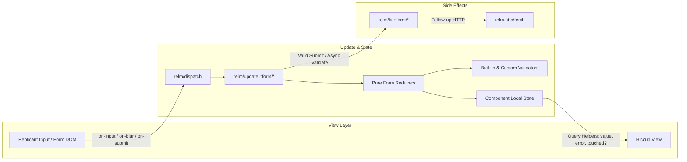

# Requirements

### Overview & Goals
Design and implement a declarative, robust form state management module (`com.lambdaseq.relm.form`) for Relm. The module provides Elm-architecture / Model-View-Update (MVU) state management for forms, inspired by Formik and React Hook Form, but tailored to Relm's component local state, `relm/update` multimethods, and `relm/fx` side effects.

### Scope
- **In Scope**:
  - Pure form state data structures (values, initial values, touched fields, validation errors, dirty state, submission status).
  - Out-of-the-box built-in validators (`required`, `email`, `min-num`, `max-num`, `min-length`, `max-length`, `pattern`, `one-of`).
  - Extensible custom validation functions (field-level and whole-form level).
  - Component-local state integration via pure reducers and `relm/update` message handlers (`::form/change`, `::form/blur`, `::form/submit`, `::form/reset`).
  - Granular Hiccup query functions (`form/value`, `form/error`, `form/touched?`, `form/dirty?`, `form/valid?`, etc.).
  - Asynchronous validation and side-effect support via `relm/fx`.
  - Nested path support (e.g. `[:user :address :city]`).
  - Interactive example in `examples` and unit tests in `core/test`.

- **Out of Scope**:
  - Heavy external schema library dependencies (Malli / clojure.spec are not hard dependencies; validator adapters can be plugged in).
  - UI component libraries / pre-styled inputs (the module is headless and works directly with Hiccup markup).

### User Stories
- **As a Relm developer**, I want to initialize a form state in my component's `init` function so that I can track field values, validation errors, and dirty state predictably.
- **As a Relm developer**, I want built-in validators (like `required`, `email`, `min-num`) and custom validator functions so that I can enforce business rules with minimal boilerplate.
- **As a Relm developer**, I want granular query helpers like `(form/value form :email)` and `(form/error form :email)` so that I can build custom, flexible Hiccup markup with full control over layout.
- **As a Relm developer**, I want form submission to validate all fields, mark them touched, and dispatch `on-submit` effects when valid (or `on-invalid` when invalid).

### Functional Requirements
- **FR-1 Form Initialization**: `(form/create {:initial-values map, :validators map, :validate fn, :validate-on #{:change :blur :submit}})` creates a normalized form state.
- **FR-2 Value & Touch Tracking**: Update field values on input/change and track touched paths on blur.
- **FR-3 Built-in Validation**: Provide built-in validation rules (`required`, `email`, `min-num`, `max-num`, `min-length`, `max-length`, `pattern`, `one-of`, `compose`).
- **FR-4 Custom Validation**: Allow passing custom synchronous validation functions `(fn [values] error-map)` and async validator effects.
- **FR-5 Dirty & Pristine Tracking**: Accurately calculate if current values differ from initial values (globally or per field path).
- **FR-6 Submission Workflow**:
  - Running full validation on submit.
  - Marking all validated fields as touched.
  - If valid: setting `:submitting? true`, incrementing `:submit-count`, and executing `on-submit` message/effect.
  - If invalid: preventing submission and optionally executing `on-invalid` message/effect or focusing first error.
- **FR-7 Granular Query Helpers**: Provide pure query helpers for views: `value`, `error`, `touched?`, `dirty?`, `valid?`, `invalid?`, `submitting?`, `submit-count`.

### Non-Functional Requirements
- **Zero Heavy Dependencies**: Pure Clojure/ClojureScript implementation compatible with JVM (`.clj`) and JS (`.cljs`).
- **Performance**: Structural sharing with pure Clojure maps/sets; no unnecessary DOM re-renders.
- **Composability**: Easily embeddable inside any component local state map.

# Technical Design

### Current Implementation
Relm currently provides:
- `com.lambdaseq.relm.core`: Central MVU runtime with component-isolated state (`!app-state [:components comp-id :state]`), `update` multimethod for state transitions, and `fx` multimethod for side effects.
- `com.lambdaseq.relm.http`: Asynchronous HTTP requests using `fetch` with callback message dispatch.
- `com.lambdaseq.relm.navigation` and `com.lambdaseq.relm.reitit`: Declarative navigation effects and router synchronization in `:context`.

Form handling currently requires manual state management in components without standardized validation, dirty tracking, or touch tracking.

### Key Decisions
1. **Component-Local Reducer Architecture**:
   - *Decision*: Form state is stored directly within the component's local state map (e.g. `{:form (form/create ...)}`).
   - *Rationale*: Aligns directly with Relm's existing MVU architecture without introducing synthetic component hierarchies or breaking component isolation.
2. **Built-in Rule Validators + Custom Validation Functions**:
   - *Decision*: Provide core validator constructors (`required`, `email`, `min-num`, `max-num`, `min-length`, etc.) while allowing arbitrary `(fn [values] ...)` custom validators.
   - *Rationale*: Gives instant out-of-the-box utility without locking the project into external schema dependencies like Malli or Spec.
3. **Granular Query Helpers for Hiccup**:
   - *Decision*: Provide explicit query functions (`form/value`, `form/error`, `form/touched?`, `form/dirty?`) and event handler builders (`form/on-change`, `form/on-blur`, `form/on-submit`).
   - *Rationale*: Maximizes flexibility for custom input components, conditional styling, and layout structure in Hiccup views.

### Architecture Diagram


### Data Models / Contracts

#### Form State Map
```clojure
{:values         {:email "test@example.com"
                  :profile {:age 25 :bio "Hello"}}
 :initial-values {:email ""
                  :profile {:age nil :bio ""}}
 :touched        #{[:email] [:profile :age]}
 :errors         {[:email] "Invalid email address"}
 :validators     {[:email]        [form/required form/email]
                  [:profile :age] [(form/min-num 18 "Must be at least 18")]}
 :validate-fn    (fn [values] ...) ;; Optional whole-form validator
 :validate-on    #{:change :blur :submit}
 :submitting?    false
 :submit-count   0
 :status         nil}
```

#### Core API Signatures (`com.lambdaseq.relm.form`)
```clojure
;; Constructor
(defn create
  [{:keys [initial-values validators validate validate-on]}])

;; Pure Reducers
(defn set-value [form-state path value])
(defn set-values [form-state new-values])
(defn set-touched [form-state path is-touched?])
(defn touch-all [form-state])
(defn set-error [form-state path error-msg])
(defn set-errors [form-state errors-map])
(defn clear-errors [form-state])
(defn validate-form [form-state])
(defn reset-form [form-state & [new-initial-values]])
(defn submit-start [form-state])
(defn submit-end [form-state & [status]])

;; Granular View Queries
(defn value [form-state path & [default-val]])
(defn error [form-state path])
(defn touched? [form-state path])
(defn dirty? [form-state & [path]])
(defn valid? [form-state])
(defn invalid? [form-state])
(defn submitting? [form-state])
(defn submit-count [form-state])

;; Event Handler Helpers
(defn on-change [form-key path])
(defn on-blur [form-key path])
(defn on-submit [form-key {:keys [on-submit on-invalid validate]}])

;; Built-in Validators
(defn required [& [msg]])
(defn email [& [msg]])
(defn min-num [min-val & [msg]])
(defn max-num [max-val & [msg]])
(defn min-length [min-len & [msg]])
(defn max-length [max-len & [msg]])
(defn pattern [regex & [msg]])
(defn one-of [allowed-coll & [msg]])
(defn compose [& validators])
```

### File Structure
- `core/src/com/lambdaseq/relm/form.cljc`: Core form module (reducers, validators, update handlers, effects, and view queries).
- `core/test/com/lambdaseq/relm/form_test.cljc`: Unit tests for form reducers, validators, and update lifecycle.
- `examples/src/examples/form.cljs`: Interactive example showing form validation, dynamic state, and submission.
- `examples/src/examples/main.cljs`: Add route and navigation link for the form example.

### Risks & Mitigations
- **Event Extraction Variations**: Replicant event targets differ based on input types (checkbox `checked`, text `value`, select options).
  - *Mitigation*: Implement robust helper `-extract-event-value` handling various DOM input types with fallbacks.
- **Nested Field Path Consistency**: Paths can be specified as single keywords (e.g. `:email`) or vectors (e.g. `[:user :email]`).
  - *Mitigation*: Normalize all paths internally to vectors via `(if (vector? p) p [p])`.

# Testing

### Validation Approach
Automated testing using `clojure.test` / `cljs.test` covering pure state transitions, validation execution, message handling, and side-effect generation.

### Key Scenarios
1. **Form Creation & Initialization**:
   - Initial values correctly populated, touched set empty, errors map empty, dirty flag false.
2. **Field Changes & Value Updates**:
   - Changing field updates `:values` at flat and nested paths.
   - `:dirty?` becomes true when value differs from `:initial-values`.
3. **Built-in Validation Rules**:
   - `required`: rejects `nil`, `""`, and empty collections; passes non-empty values.
   - `email`: rejects malformed email strings; passes valid email formats.
   - `min-num` / `max-num`: validates numeric thresholds.
   - `min-length` / `max-length`: validates string/collection length.
   - `pattern`: validates regex matches.
   - `one-of`: validates membership in allowed set.
   - `compose`: evaluates pipeline of validators in sequence.
4. **Custom Validator Integration**:
   - Custom `validate-fn` executes and merges errors into `:errors`.
5. **Touch & Blur Handling**:
   - `::form/blur` marks specified field path as touched.
   - Field errors are visible through `(form/error form path)` when touched or queried directly.
6. **Form Submission Lifecycle**:
   - Submitting invalid form runs full validation, touches all fields, prevents `on-submit`, and triggers `on-invalid` if provided.
   - Submitting valid form sets `:submitting? true`, increments `:submit-count`, and returns configured `on-submit` message/effects.
7. **Form Reset**:
   - `::form/reset` restores values to initial values, clears touched fields, and clears error maps.

### Edge Cases
- Checkbox boolean inputs (`checked` property vs string `value`).
- Numeric inputs parsing strings to numbers where appropriate.
- Nested paths with missing intermediate maps.
- Dynamic field arrays (adding/removing items from vector values).

### Test Changes
- New test file: `core/test/com/lambdaseq/relm/form_test.cljc` with tests covering all core reducers, validation rules, update messages, and queries.

# Delivery Steps

### ✓ Step 1: Implement Core Form State Reducers and Built-in Validators
Pure form state manipulation and built-in validator functions are fully implemented and testable in `com.lambdaseq.relm.form`.

- Create `core/src/com/lambdaseq/relm/form.cljc` with core form constructor `create`.
- Implement pure state transformation functions: `set-value`, `set-values`, `set-touched`, `touch-all`, `set-error`, `set-errors`, `clear-errors`, `reset-form`, `submit-start`, and `submit-end`.
- Implement built-in validation rules: `required`, `email`, `min-num`, `max-num`, `min-length`, `max-length`, `pattern`, `one-of`, and `compose`.
- Implement validation execution engine `validate-form` supporting field-level validator rules and custom whole-form validation functions.
- Add pure unit tests in `core/test/com/lambdaseq/relm/form_test.cljc` for validation rules and state transformations.

### ✓ Step 2: Implement Relm Update Message Handlers and Effects
Relm components can dispatch declarative form messages to handle user input, blur events, validation, and submission lifecycles.

- Implement DOM event extraction helper to extract values from Replicant DOM events (supporting text inputs, checkboxes, radios, select dropdowns, and number types).
- Register `relm/update` multimethod handlers in `com.lambdaseq.relm.form`:
  - `::form/change` for field value updates and optional immediate validation.
  - `::form/blur` for marking fields touched and triggering blur validation.
  - `::form/set-field` and `::form/set-values` for programmatic updates.
  - `::form/reset` for restoring initial state.
  - `::form/submit` for executing validation, touching all fields, and invoking `on-submit` or `on-invalid` actions.
- Implement `relm/fx` side effects for async validation (`::form/validate-async`) and DOM focus on invalid inputs (`::form/focus-field`).

### ✓ Step 3: Implement Granular Query Functions and Hiccup View Helpers
Developers can easily query form state and attach event handlers in Hiccup views using granular query helpers.

- Implement granular query functions: `value`, `error`, `touched?`, `dirty?`, `valid?`, `invalid?`, `submitting?`, and `submit-count`.
- Implement event-binding builders: `on-change`, `on-blur`, and `on-submit` that generate standard Replicant event vectors.
- Ensure nested path support (e.g. `[:user :address :street]`) across all query and event helper functions.
- Add helper tests validating query functions against various form states.

### ✓ Step 4: Build Form Example Component and Comprehensive Test Suite
An interactive example component demonstrates the form module in the example app with comprehensive unit test coverage.

- Create `examples/src/examples/form.cljs` demonstrating a registration/profile form with validation, dirty indicators, error messages, reset, and submission effects.
- Register the form example route and navigation tab in `examples/src/examples/main.cljs`.
- Write comprehensive unit tests in `core/test/com/lambdaseq/relm/form_test.cljc` covering form lifecycle, nested fields, validation rules, update handlers, and effects.